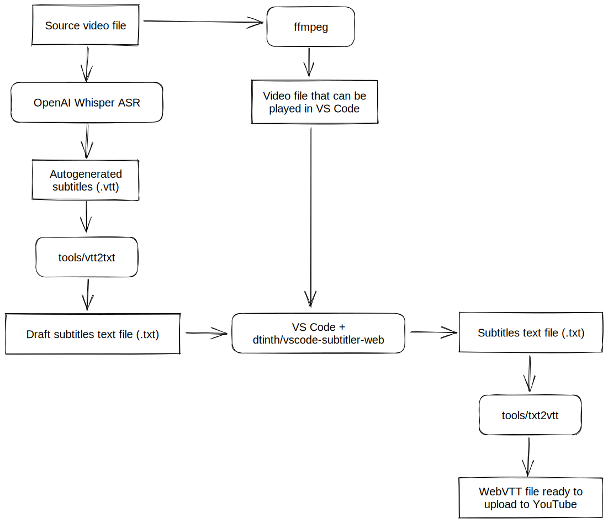

# dtinth/subtitles

This is the timed text processing pipeline that I use to create subtitles for videos on my [YouTube channel, dtinth](https://www.youtube.com/@dtinth). Yes, I use VS Code to subtitle most of my videos.

